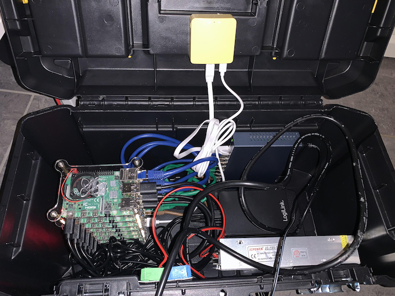

# k8s-in-a-box

Raspberry Pi K8s Cluster

<div align="center">
  
</div>

## Hardware

4 x Raspberry Pi 4 2GB

3 x Raspberry Pi 4 8GB

7 x SanDisk microSD 32GB U3 A1

3 x 500GB HDD USB3

1 x 8 Port Gigabit Switch

1 x GL-MT300N-V2 Mini Smart Router

https://openwrt.org/toh/hwdata/gl.inet/gl.inet_gl-mt300n_v2

## Setup

GL-MT300N-V2 (router) <- connect via WLAN-Client to your public WLAN, offer WLAN access Point, offer LAN

IP Addresses:
  * Router - 192.168.199.1
  * HA Proxy - 192.168.199.10
  * Master Node1 - 192.168.199.11
  * Master Node2 - 192.168.199.12
  * Master Node3 - 192.168.199.13
  * Worker Node1 - 192.168.199.21
  * Worker Node2 - 192.168.199.22
  * Worker Node3 - 192.168.199.23


## Installation

### OS Preparation

Flash SD Cards with Raspberry Pi Imager (https://www.raspberrypi.org/downloads/). Choose Ubuntu 20.04.1 LTS for arm64.

Edit network-config on the SD Card.

```
version: 2
ethernets:
  eth0:
    addresses:
      - 192.168.199.10/24
    dhcp4: no
    gateway4: 192.168.199.1
    nameservers:
        addresses: [192.168.199.1]
```

Edit meta-data on the SD Card.

```
instance_id: proxy.k8s.lan
```

Edit user-data on the SD Card.

```
# On first boot, set the (default) ubuntu user's password to "ubuntu" and
# expire user passwords
chpasswd:
  #expire: true
  list:
  - ubuntu:ubuntu
users:
- name: deploy
  gecos: K8s Deployment User
  sudo: ALL=(ALL) NOPASSWD:ALL
  groups: users, admin
  ssh_import_id: None
  lock_passwd: true
  ssh_authorized_keys:
  - ssh-rsa AAAAB3NzaC1yc2EAAAADAQABAAABAQCpSyhHsctydITvC2XeqLYOZtbkKhOAf3f9sy8MYMpFcKQ2CRJ5DVMgRJyUR6yYLqlMTxZW7i9UaB0r+Bzgis3ay3N7EubJgZDPSNe3RyVvS1EShahEZeijZL0mhU4xq8Ui/LGjpOhGEtSCV/5CIqxPINlpVKlXfHgInJvEYA+hY6rns8+x8shq9KYb/Frpj2DftgZJoEVfEgFxrUIaiZA68KKPMVdTxL5B4xmBIofPvbhEZbQCsysjjJGTA+SUCSC3rKyM1UsqGntz+oftd5HN2XNfCDNVKFLOkKTRIfPZc8MrYlC5bB6cx02HYY9fm/1UiOuihZdCklkySQ+B7Igj

# Enable password authentication with the SSH daemon
ssh_pwauth: true
```

### Ansible

Join the vagrant machine.

```
cd vagrant
vagrant up
vagrant ssh
```

Then join the ansible folder and run ansible-playbook.

```
cd ansible
ansible-playbook playbook.yml
```

### Kubernetes

  * https://phoenixnap.com/kb/how-to-install-kubernetes-on-a-bare-metal-server
  * https://opensource.com/article/20/6/kubernetes-raspberry-pi
  * https://www.serverlab.ca/tutorials/containers/kubernetes/deploying-kubernetes-ubuntu-18-04/
  * https://thenewstack.io/how-to-deploy-a-kubernetes-cluster-with-ubuntu-server-18-04/
  * https://www.youtube.com/watch?v=qv3_gLvjITk
  * https://kubernetes.io/docs/setup/production-environment/tools/kubeadm/install-kubeadm/
  * https://kubernetes.io/docs/setup/production-environment/tools/kubeadm/create-cluster-kubeadm/
  * https://kubernetes.io/docs/setup/production-environment/tools/kubeadm/high-availability/#stacked-control-plane-and-etcd-nodes
  * https://kubernetes.io/docs/concepts/storage/
  * https://linuxconfig.org/how-to-install-kubernetes-on-ubuntu-18-04-bionic-beaver-linux
  * https://bee42.com/de/blog/tutorials/kubernetes-cluster-on-embedded/
  * https://rook.io/
  * https://rook.io/docs/rook/v1.4/ceph-quickstart.html
