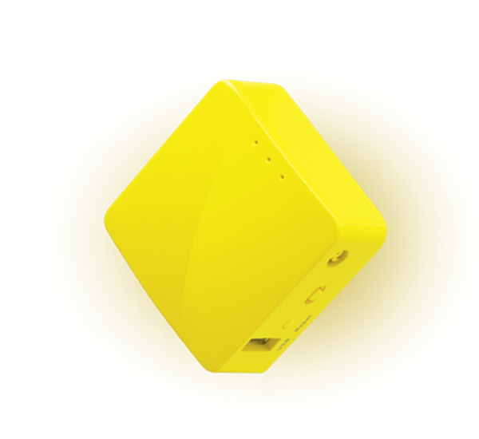
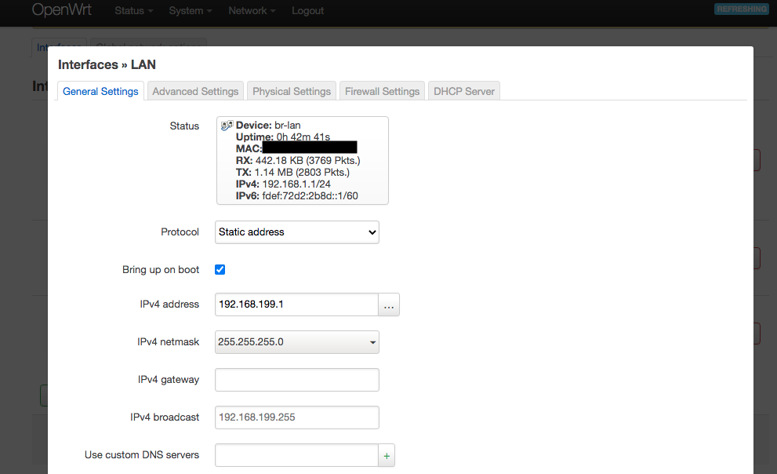
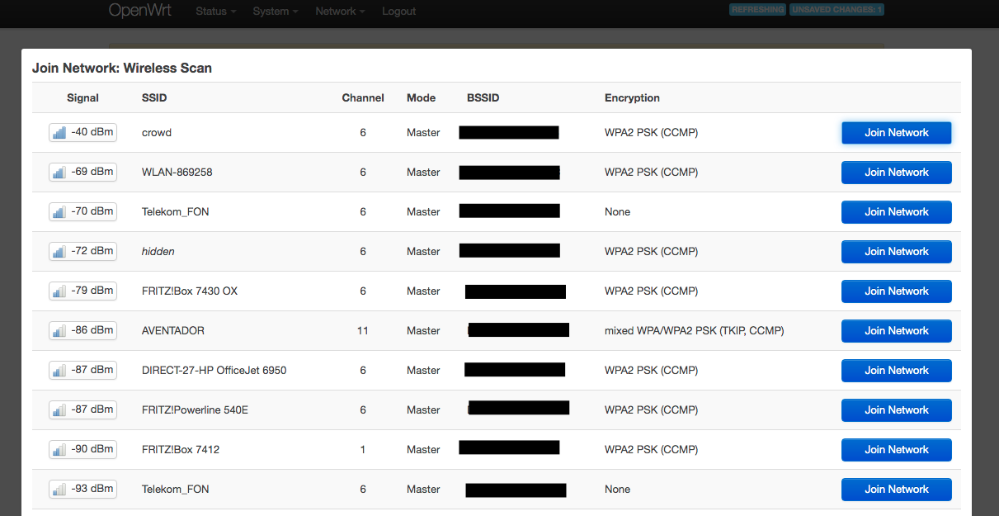
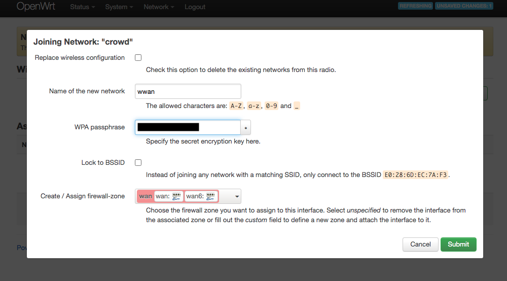
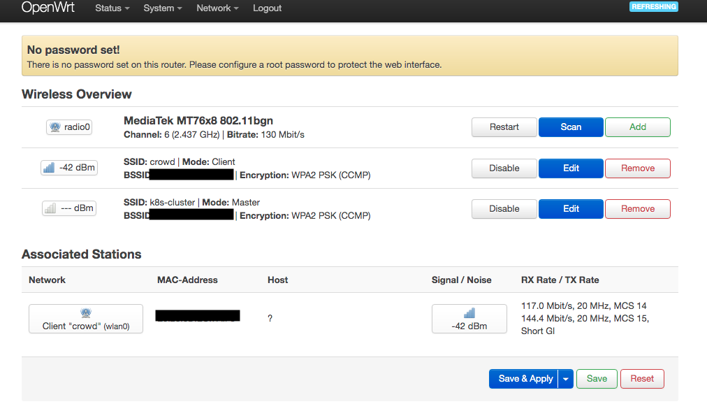
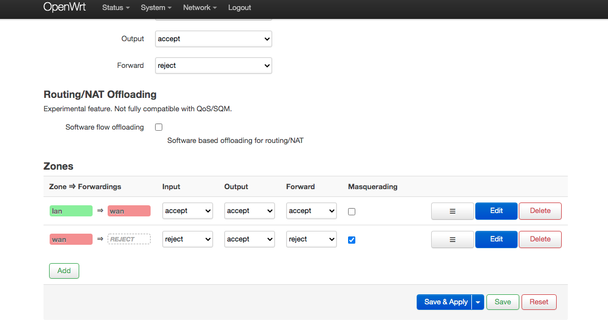
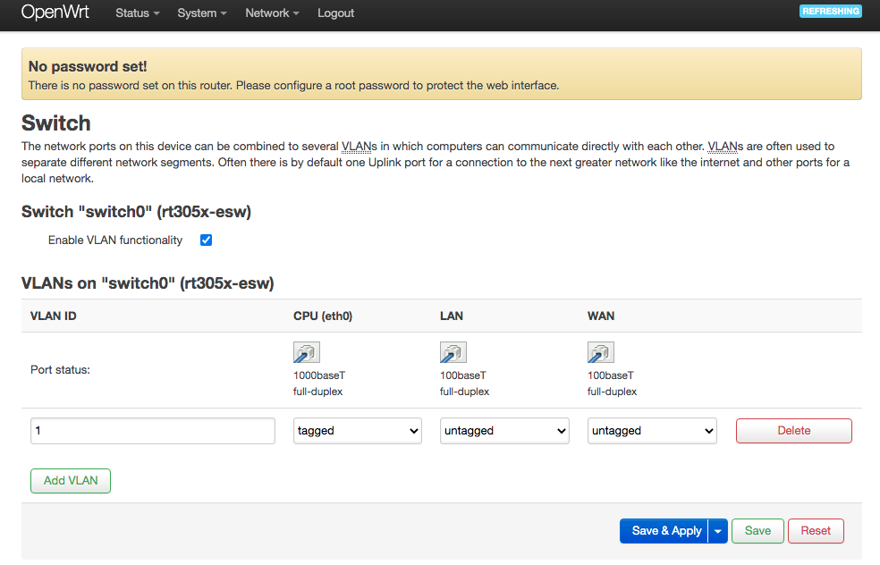
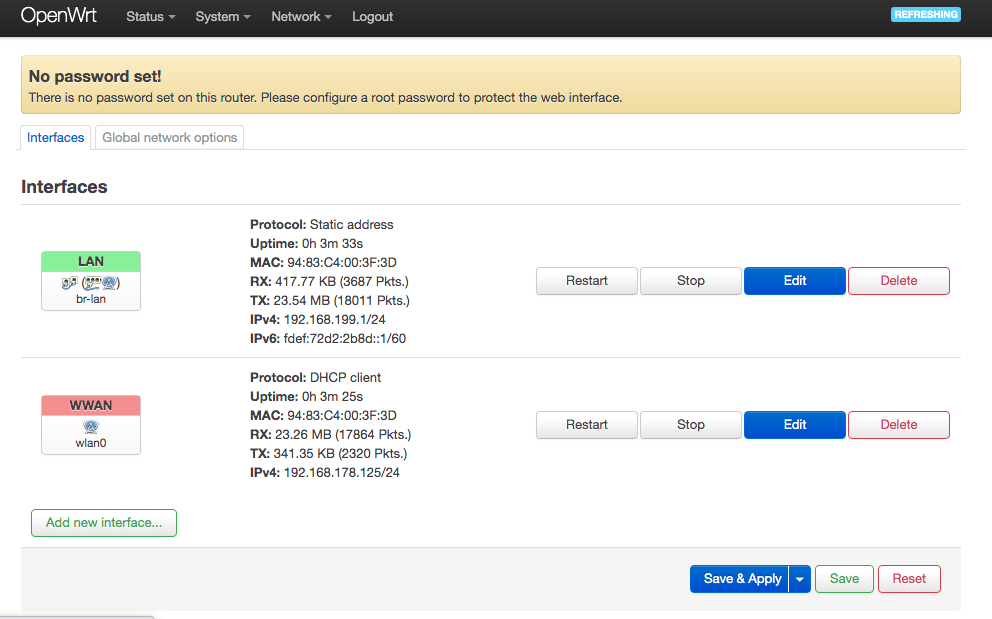
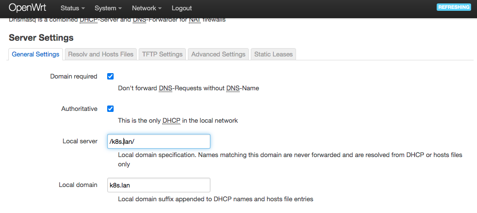
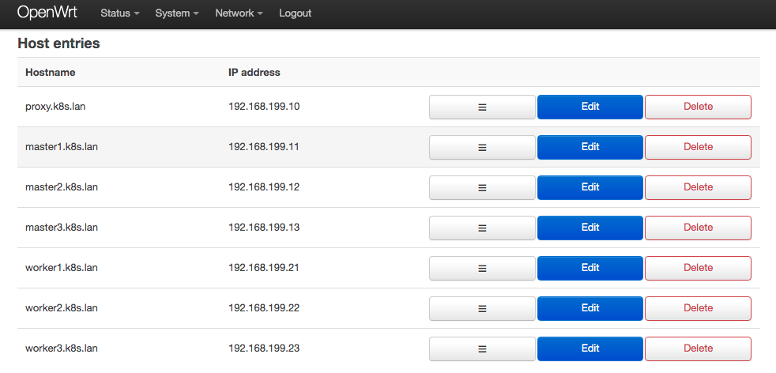

# Router

  
  
GL-MT300N-V2

The K8s Cluster is connected to a small router, which connects the cluster to the internet and third party clients to the cluster.

## Configuration

The router is connected via WIFI in client mode to the local WLAN. This connection works as the WAN port.

The router also offers a WIFI access point to serve clients, that want to connect to the K8s Cluster.

Also both eth ports (LAN and WAN) are bridged together with the AP to buld the lan network.

It offers DHCP and DNS on all lan ports.

## Setup

The router comes equipped with a custom OpenWRT Installation. Download the latest "Firmware OpenWrt Upgrade" from [here](https://openwrt.org/toh/hwdata/gl.inet/gl.inet_gl-mt300n_v2) and upload it through the webinterface of the router.

You can follow this [Youtube Video](https://www.youtube.com/watch?v=CXHAzuONy-U) for help.

After Flashing the router, restart it and afterwards do a clean reset by pressing the "reset" button on the router for more than 3 seconds.

Now connect to the router via LAN port and open the web ui on http://192.168.1.1/.

### Configure the Network Address

Go to __Network -> Interfaces__ and **Edit** the LAN interface.

  

Change the IP Address to the desired network and press "Save". Afterwards press "Save and Apply".

To apply the changes, you need to change the ip address in the browser and reload the page. Otherwise the settings will be rolled back.

### Connect to your local WLAN via client mode

Go to __Network -> Wireless__ and remove all SSIDs.

  

Press "Scan" on radio0 and "Join" your local WLAN.

  

Keep the name "wwan", set the net WPA Passphrase and assign the WAN Firewall zone.

Again "Save and Apply" to apply the changes.

### Provide Access Point

On __Network -> Wireless__ press "Add" next to radio0.

  

Set your ESSID and select LAN for the Network. Also set your "Wireless Security"
Settings and Save.

Again "Save and Apply" to apply the changes.

__Network -> Wireless__ now looks similar to the following:

  

Now connect to the router via the new AP and disconnect your LAN cable.

### Firewall

__Network -> Firewall__ should look the following:

  

### Configure the switch ports

Go to __Network -> Switch__ and remove VLAN ID 2.

  

### Configure the interfaces

Go to __Network -> Interfaces__ and remove all interfaces except LAN and WWAN.

  

### Configure DNS

Go to __Network -> DHCP and DNS__ and set Local Server and Local Domain.

  

Go to __Network -> Hostnames__ and create the entries for all 7 nodes.

  

